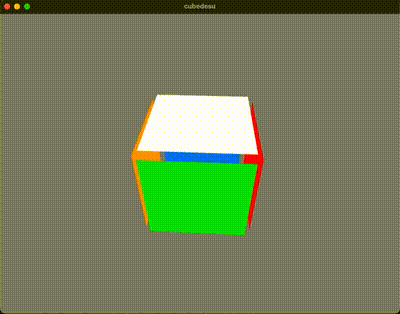

# cubedesu

Rubik's Cube simulator written in Rust. Play it at https://stanleydesu.github.io/cubedesu/ !

## Features
- Visual simulation of a 3x3 cube, allowing moves with [keyboard input](./keymap.png)




## Usage

Build the project (optionally in release mode):
```sh
$ cargo build [--release]
```

Run the project:
```sh
$ cargo run
```

Or use the web version (slower): https://stanleydesu.github.io/cubedesu/

## Project Structure
- ``src/lib``: Cube related types, such as a Face, Move, Turn, Movement (a Move associated with a Turn)
- ``src/geometry_model``: Geometric implementation of a cube, represented with an array of all the cube's stickers (3-dimensional points) and moves as rotations amongst some axis
- ``src/facelet_model``: Facelet implementation of a cube, represented as an array of stickers, ordered by U, R, F, D, L, then B face
- ``src/vec3``: Custom memory-efficient 3D vector implementation designed specifically for the geometry model

## Dependencies
- Thanks to [macroquad](https://crates.io/crates/macroquad), brilliant and simple API that helped with easily rendering a cube
- Thanks to [strum](https://crates.io/crates/strum), facilitated parsing of strings into Moves and Turns as well as enum iteration and serialization
- Thanks to [proptest](https://crates.io/crates/proptest), great for property-based testing

## Resources Used
- [Onionhoney's extremely well written article on modelling Rubik's Cubes](https://observablehq.com/@onionhoney/how-to-model-a-rubiks-cube)
